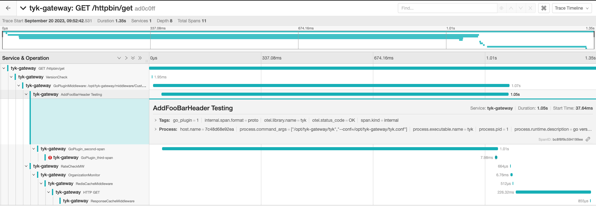
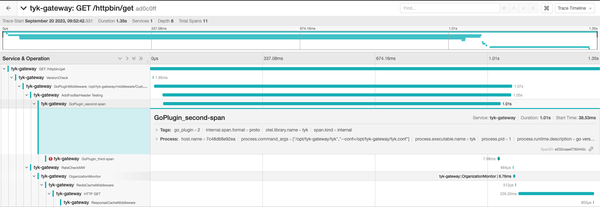
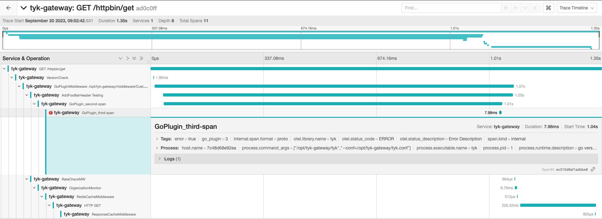

# Open Telemetry Instrumentation Example

> [!WARNING]
> Please keep in mind that this Custom Go Plugin is not production ready and should only be used to get started.

For more information please visit our official documentation on [How to instrument plugins with OpenTelemetry](https://deploy-preview-3184--tyk-docs.netlify.app/docs/nightly/product-stack/tyk-gateway/advanced-configurations/plugins/otel-plugins/).

This custom plugin example demonstrates the ability to:
1. Creating a new span from the current request context
2. Modifying the span name and set the span status
3. Setting attributes (key-value pairs) on your spans
4. Instrumenting multiple functions using multiple spans
5. Adding error handling

## How to test the Custom Plugin
1. Copy the example source code in `CustomGoPlugin.go` file in the current directory and place it in the `go/src/CustomGoPlugin.go` file.

2. Execute the make command to compile the plugin:
```
make build
```

3. Setup your API

In this example we will be using `http://httpbin.org/` as the upstream target. It's essentially a simple HTTP mock request and response service.

a. Enable `detailed_tracing` in your API definition
```
{
    ...
    "detailed_tracing": true
    ...
}
```

b. Configure your `custom_middleware` in your API definition
```
"custom_middleware": {
    ...
    "pre": [{
        "disabled": false,
        "name": "AddFooBarHeader",
        "path": "/opt/tyk-gateway/middleware/CustomGoPlugin.so",
        "require_session": false,
        "raw_body_only": false
    }],
    "driver": "goplugin",
    ...
}
```

4. Send an API request
```
❯ curl http://localhost:8080/httpbin/get
{
  "args": {},
  "headers": {
    "Accept": "*/*",
    "Accept-Encoding": "gzip",
    "Foo": "Bar",
    "Host": "httpbin.org",
    "Traceparent": "00-ad0c0ff26fe15d8a10d631c1d804f10f-1bc462c0ccdfcd4e-01",
    "User-Agent": "curl/8.1.2",
    "X-Amzn-Trace-Id": "Root=1-650af92b-06efeb043632bec55b426c8d"
  },
  "origin": "172.26.0.1, 99.242.28.149",
  "url": "http://httpbin.org/get"
}
```

5. Open the [Jaeger Dashboard](http://localhost:16686/) in a browser

Set the search `Service` to `tyk-gateway` and select the trace.

First Span - `func AddFooBarHeader()`



Second Span - `func NewFunc()`



Third Span - `func NewFuncWithError()`

